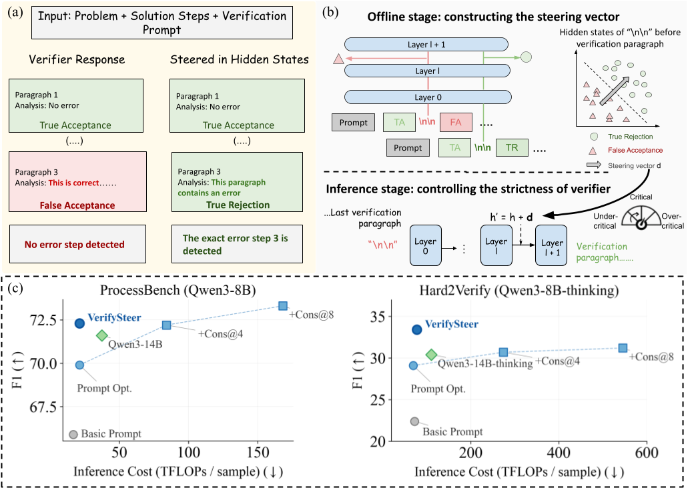

# The Hidden Signal of Step-Wise Verification: Controlling LLM Strictness via Latent Steering

This repository contains the code and artifacts for **VerifySteer**, a training-free method that controls the strictness of generative LLM verifiers via hidden-state steering.

> **TL;DR:** We find that a verifier's tendency to accept or reject a solution step is encoded in the hidden state of the `\n\n` delimiter token preceding the corresponding verification paragraph. VerifySteer exploits this signal for sample-level routing and selective paragraph-level intervention, outperforming self-consistency while requiring 4–7× less inference compute.



---
## Installation

```bash
# 1. Create environment
conda create -n verifysteer python=3.10 -y
conda activate verifysteer

# 2. Download precompiled .so files for the steering-enabled vLLM backend
python download_so.py

# 3. Install the steering-enabled vLLM (EasySteer)
cd EasySteer/vllm-steer
bash install_precompiled.sh

# 4. Install EasySteer
cd ..
pip install --editable .

# 5. Return to repo root and install remaining dependencies
cd ..
pip install transformers datasets huggingface_hub scikit-learn
```

The precompiled `.so` files are fetched from [`YefanZhou98/vllm-wheel-steer`](https://huggingface.co/datasets/YefanZhou98/vllm-wheel-steer) on Hugging Face. The underlying vLLM fork is in `EasySteer/vllm-steer` and adds a `SteerVectorRequest` interface for token-level hidden-state intervention.

---

## Download Artifacts

Steering vectors, correctness probe weights, and precomputed inference outputs are hosted on Hugging Face at [`YefanZhou98/VerifySteer`](https://huggingface.co/YefanZhou98/VerifySteer).

```bash
python download_artifacts.py
```

This downloads all three artifact directories (~70 MB total): `steering_vector/`, `verify_mlp_probe_weights/`, and `precomputed_results/` (the baseline and steered inference outputs used by the analysis notebook).

The expected directory layout after downloading:

```
steering_vector/
├── Qwen3-1.7B/
│   ├── gsm8k/{increasing,decreasing}_strictness.gguf
│   ├── math/{increasing,decreasing}_strictness.gguf
│   └── olympiadbench_omnimath/{increasing,decreasing}_strictness.gguf
├── Qwen3-8B/
│   ├── gsm8k/  math/  olympiadbench_omnimath/
├── Qwen3-8B-thinking/
│   └── h2v/{increasing,decreasing}_strictness.gguf
└── FARE-20B/
    └── h2v/{increasing,decreasing}_strictness.gguf

verify_mlp_probe_weights/
└── processbench/
    ├── Qwen3-1.7B/  ...
    └── Qwen3-8B/    ...

precomputed_results/
├── Qwen3-1.7B/
│   ├── enable_thinking_False/baseline/{processbench,processbench_careful_v1}/
│   └── gated_norm_direct_cosine_mask/{gsm8k,math,olympiadbench,omnimath}/{increasing,decreasing}_strictness/
└── Qwen3-8B/
    ├── enable_thinking_False/baseline/{processbench,processbench_careful_v1}/
    └── gated_norm_direct_cosine_mask/{gsm8k,math,olympiadbench,omnimath}/{increasing,decreasing}_strictness/
```

---

## Running Baselines (No Steering)

### ProcessBench

```bash
# Qwen3-1.7B or Qwen3-8B, greedy decoding
# Set config ∈ {gsm8k, math, olympiadbench, omnimath}
MODEL_PATH=Qwen/Qwen3-1.7B
CONFIG=gsm8k

CUDA_VISIBLE_DEVICES=0 python run_eval_baseline.py \
    --model_path $MODEL_PATH \
    --configs $CONFIG \
    --run_num 0 \
    --prompt-type processbench_careful_v1 \
    --max_num_seqs 40 \
    --output_dir ./results \
    --max_output_length 8192 \
    --greedy
```

See [`run_baseline_processbench.sh`](run_baseline_processbench.sh) for the full script.

**Prompt types:**
- `processbench` — standard ProcessBench prompt
- `processbench_careful_v1` — optimized prompt (adapted from Zhang et al., 2025;)

### Hard2Verify

```bash
# Qwen3-8B with thinking mode
CUDA_VISIBLE_DEVICES=0 python run_eval_baseline.py \
    --model_path Qwen/Qwen3-8B \
    --configs h2v \
    --run_num 0 \
    --prompt-type h2v_error_id \
    --max_num_seqs 30 \
    --output_dir ./results \
    --max_output_length 16384 \
    --enable_thinking

# FARE-20B
CUDA_VISIBLE_DEVICES=0 python run_eval_baseline.py \
    --model_path Salesforce/FARE-20B \
    --configs h2v \
    --run_num 0 \
    --prompt-type fare \
    --max_num_seqs 40 \
    --output_dir ./results \
    --max_output_length 16384 \
    --greedy \
    --max_model_len 40960 \
    --gpu_memory_utilization 0.85 \
    --enforce_eager True
```

See [`run_baseline_h2v.sh`](run_baseline_h2v.sh) for the full script.

---

## Running VerifySteer

VerifySteer-Uni and VerifySteer-Bi are produced by three steps run in sequence:

| Step | What it does | Script |
|---|---|---|
| 1 | Run uniform steering on all test samples | `steer_run_eval.py` |
| 2 | Collect test-set hidden states, run probe → per-sample correctness score | `verify_mlp_probe/` |
| 3 | Route: select strict/lenient/no-steering output per sample based on probe score | `verifysteer_results.ipynb` |

> **Note:** Running `steer_run_eval.py` alone (Step 1) applies steering **uniformly** to all samples, The sample-level routing in Step 3 is what produces the VerifySteer variants.

### Step 1 — Run uniform steering

Run `steer_run_eval.py` twice: once with `increasing_strictness` (needed for both Uni and Bi) and once with `decreasing_strictness` (needed for Bi only). Edit `vector_type` at the top of the shell scripts to switch direction.

#### ProcessBench

```bash
# Set MODEL_PATH, CONFIG, and vector_type at the top of the script
bash script_steer_processbench.sh
```

The script automatically picks the steering vector path, layer range, α (`--vector_scale`), and ρ (`--beta`) for the chosen model. Full example for Qwen3-1.7B, gsm8k, increasing strictness:

```bash
CUDA_VISIBLE_DEVICES=0 python steer_run_eval.py \
    --model_path Qwen/Qwen3-1.7B \
    --configs gsm8k \
    --run_num 0 \
    --control_vector_path steering_vector/Qwen3-1.7B/gsm8k/increasing_strictness.gguf \
    --vector_scale 3.0 \
    --layer_range 16 18 \
    --beta 0.6 \
    --prompt-type processbench_careful_v1 \
    --steering_mode gated_norm_direct_cosine_mask \
    --max_num_seqs 40 \
    --output_dir ./results \
    --max_output_length 8192 \
    --greedy
```

#### Hard2Verify

```bash
# Set MODEL_PATH and vector_type at the top of the script
bash script_steer_h2v.sh
```

Full example for Qwen3-8B-thinking, increasing strictness:

```bash
CUDA_VISIBLE_DEVICES=0 python steer_run_eval.py \
    --model_path Qwen/Qwen3-8B \
    --configs h2v \
    --run_num 0 \
    --control_vector_path steering_vector/Qwen3-8B-thinking/h2v/increasing_strictness.gguf \
    --vector_scale 1.5 \
    --layer_range 22 23 \
    --beta 0.0 \
    --prompt-type h2v_error_id \
    --steering_mode gated_norm_direct_cosine_mask \
    --max_num_seqs 30 \
    --output_dir ./results \
    --max_output_length 16384 \
    --enable_thinking
```

The `gated_norm_direct_cosine_mask` mode implements Equation (5) in the paper: it renormalizes the steered hidden state and uses the cosine-similarity gate (ρ, passed as `--beta`) to skip delimiter tokens already aligned with the steering direction.

### Step 2 — Collect test-set hidden states and run the correctness probe

**Sub-step 2a — collect hidden states from the test split** (`collect_hidden_states.py` saves `.pt` files; it does *not* produce predictions):

```bash
cd verify_mlp_probe

python collect_hidden_states.py \
    --model_name Qwen/Qwen3-8B \
    --output_dir /path/to/hidden_states \
    --config gsm8k \
    --template-type verify \
    --prompt-type processbench_careful_v1
```

**Sub-step 2b — run the pre-trained probe on the saved hidden states** (`eval_mlp_probe.sh` loads the `.pt` files + probe checkpoint and writes `layer_23_predictions.json`):

```bash
HIDDEN_STATES_DIR=/path/to/hidden_states bash eval_mlp_probe.sh
```

`eval_mlp_probe.sh` writes `layer_23_predictions.json` (Qwen3-8B) or `layer_17_predictions.json` (Qwen3-1.7B) under `verify_mlp_probe_weights/`. Each entry has `id`, `true_label`, `predicted_label`, and `predicted_prob` — the probability that the candidate solution is fully correct.

### Step 3 — Route outputs to obtain VerifySteer-Uni / VerifySteer-Bi

The routing is implemented in [`verifysteer_results.ipynb`](verifysteer_results.ipynb). Using the probe predictions from Step 2 and the steered outputs from Step 1, it applies the routing policy (Equation 4 in the paper) and produces the final results and visualizations reported in the paper:

- **VerifySteer-Uni**: use the `increasing_strictness` output for samples where `predicted_prob ≤ τ_l`; use the baseline (no-steering) output otherwise.
- **VerifySteer-Bi**: use `increasing_strictness` for `predicted_prob ≤ τ_l`, `decreasing_strictness` for `predicted_prob ≥ τ_h`, and baseline in the uncertainty region.

**Shortcut — skip Steps 1 and 2:** If you have already run `python download_artifacts.py`, all required inference outputs are in `precomputed_results/` and probe predictions are in `verify_mlp_probe_weights/`. You can open `verifysteer_results.ipynb` and run it directly to reproduce the reported numbers and plots.

> **Note:** The notebook uses absolute paths pointing to `/data/yefan/VerifySteer`. Update the path variables at the top of the relevant cells if your repo is located elsewhere.

### Hyperparameter reference (Table 5 in paper)

| Model | Benchmark | Layers | α\_strict | α\_lenient | τ\_l | τ\_h | ρ\_strict | ρ\_lenient |
|---|---|---|---|---|---|---|---|---|
| Qwen3-1.7B | ProcessBench | {16, 18} | 3.0 | 3.0 | 0.5 | 0.7 | 0.6 | 0.4 |
| Qwen3-8B | ProcessBench | {22, 23} | {1.0, 2.0} | 1.5 | 0.5 | 0.7 | 0.0 | 0.0 |
| Qwen3-8B-thinking | Hard2Verify | {22, 23} | 1.5 | 1.5 | 0.6 | 0.7 | 0.0 | 0.1 |
| FARE-20B | Hard2Verify | {17, 21} | 1.0 | 1.0 | 0.6 | 0.7 | 0.4 | 0.4 |

---

## Repository Structure

```
VerifySteer/
├── steer_run_eval.py          # Main VerifySteer inference script
├── run_eval_baseline.py       # Baseline inference (no steering)
├── prompts.py                 # All prompt templates
├── utils.py                   # Shared utilities (answer parsing, decryption)
│
├── script_steer_processbench.sh   # VerifySteer on ProcessBench
├── script_steer_h2v.sh            # VerifySteer on Hard2Verify
├── run_baseline_processbench.sh   # Baseline on ProcessBench
├── run_baseline_h2v.sh            # Baseline on Hard2Verify
│
├── steering_vector/           # Pre-built steering vectors (.gguf)
│   ├── Qwen3-1.7B/
│   ├── Qwen3-8B/
│   ├── Qwen3-8B-thinking/
│   └── FARE-20B/
│
├── verify_mlp_probe/          # Scripts for probe training and hidden-state collection
│   ├── collect_hidden_states.py
│   ├── eval_mlp_probe.py
│   └── eval_mlp_probe.sh
│
├── verify_mlp_probe_weights/  # Pre-trained correctness probe checkpoints
│
├── EasySteer/                 # Steering-enabled vLLM backend
│   ├── vllm-steer/            # Modified vLLM with SteerVectorRequest
│   └── easysteer/             # Python wrapper
│
└── download_so.py             # Downloads precompiled .so files from HF
```

---

---

## Acknowledgements

This project builds on [EasySteer](https://github.com/ZJU-REAL/EasySteer), [ProcessBench](https://github.com/QwenLM/ProcessBench) (Zheng et al., 2025), [Hard2Verify](https://arxiv.org/abs/2510.13744) (Pandit et al., 2025), [ActPRM](https://huggingface.co/datasets/Dkdkdkdk123456789/ActPRM) (Duan et al., 2025), and [vLLM](https://github.com/vllm-project/vllm).
